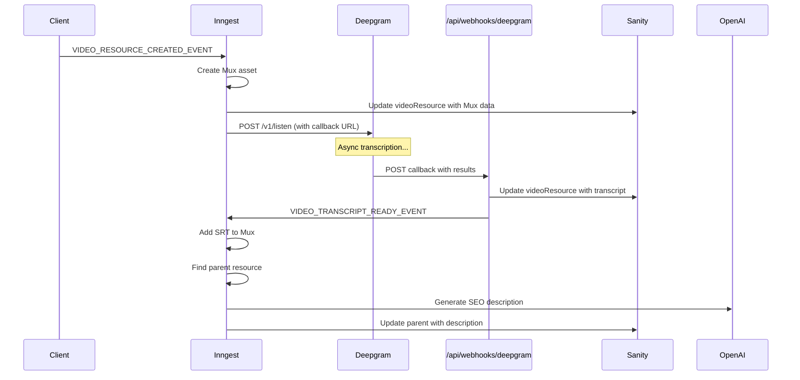

# Deepgram Transcript Webhook Implementation for Epic Web

This document outlines the requirements and implementation plan for bringing the Course Builder's Deepgram transcript webhook system to Epic Web with Sanity integration, including AI-powered SEO description generation.

---

## Table of Contents

1. [Executive Summary](#executive-summary)
2. [Current State Analysis](#current-state-analysis)
3. [Target Architecture](#target-architecture)
4. [Implementation Requirements](#implementation-requirements)
5. [Detailed Implementation Steps](#detailed-implementation-steps)
6. [Sanity Schema Updates](#sanity-schema-updates)
7. [API Routes](#api-routes)
8. [Inngest Functions](#inngest-functions)
9. [Environment Variables](#environment-variables)
10. [Testing Strategy](#testing-strategy)
11. [Migration & Rollout Plan](#migration--rollout-plan)
12. [Checklist](#checklist)

---

## Executive Summary

### Goal
Replace the current Cloudflare Worker-based Deepgram integration with a direct webhook approach, and add AI-powered SEO description auto-generation when transcripts become available.

### Key Changes
1. **Direct Deepgram Webhook** - Handle Deepgram callbacks directly in Next.js API routes
2. **Word-Level SRT** - Add support for word-level SRT in addition to standard SRT
3. **AI Description Generation** - Auto-generate SEO descriptions using OpenAI after transcript ready
4. **Multi-Resource Support** - Support tips, lessons, exercises, and other content types

### Current Flow
```
Video Upload → Cloudflare Worker → Deepgram → Cloudflare Worker → Inngest Event → Sanity
```

### Target Flow
```
Video Upload → Inngest → Deepgram (with callback URL) → Direct Webhook → Sanity → AI Description
```

---

## Current State Analysis

### Existing Infrastructure

| Component | Status | Location |
|-----------|--------|----------|
| Sanity Client (Read) | ✅ Exists | `src/utils/sanity-client.ts` |
| Sanity Client (Write) | ✅ Exists | `@skillrecordings/skill-lesson/utils/sanity-server` |
| Inngest Setup | ✅ Exists | `src/inngest/inngest.server.ts` |
| Video Processing | ✅ Exists | `src/inngest/functions/tips/process-new-tip.ts` |
| Mux Integration | ✅ Exists | `@skillrecordings/skill-lesson/lib/mux` |
| SRT to Mux | ✅ Exists | `src/inngest/functions/tips/add-srt-to-mux-asset.ts` |
| Deepgram (via CF Worker) | ✅ Exists | `deepgram-wrangler.skillstack.workers.dev` |
| Direct Deepgram Webhook | ❌ Missing | Needs implementation |
| AI Description Generation | ❌ Missing | Needs implementation |
| Word-Level SRT | ❌ Missing | Needs implementation |

### Current Deepgram Flow

The current implementation uses a Cloudflare Worker as an intermediary:

```typescript
// Current: process-new-tip.ts line 60-72
await fetch(
  `https://deepgram-wrangler.skillstack.workers.dev/transcript?videoUrl=${originalMediaUrl}&videoResourceId=${_id}`,
)
```

The Worker:
1. Receives the video URL and resource ID
2. Calls Deepgram API
3. Processes the results
4. Sends an Inngest event (`TIP_VIDEO_TRANSCRIPT_CREATED_EVENT`)

### Current Events

```typescript
// src/inngest/events.ts
TIP_VIDEO_UPLOADED_EVENT = 'tip/video.uploaded'
TIP_VIDEO_TRANSCRIPT_CREATED_EVENT = 'tip/video.transcript.created'
TIP_VIDEO_SRT_READY_EVENT = 'tip/video.srt.ready'
TIP_VIDEO_LLM_SUGGESTIONS_CREATED_EVENT = 'tip/video.llm.suggestions.created'
```

### Current Sanity Schemas

**videoResource** - Has `transcript` object with `text` and `srt` fields
**lesson** - Has `description` field (max 160 chars)
**tip** - Has `description` field (max 160 chars)

---

## Target Architecture

### New Flow Diagram

```
┌─────────────────────────────────────────────────────────────────────────────┐
│                           VIDEO PROCESSING PIPELINE                          │
└─────────────────────────────────────────────────────────────────────────────┘

┌──────────┐   ┌──────────┐   ┌──────────┐   ┌──────────┐   ┌──────────┐
│  Upload  │──▶│  Inngest │──▶│   Mux    │──▶│ Deepgram │──▶│  Webhook │
│  Video   │   │  Event   │   │  Asset   │   │ Initiate │   │ Callback │
└──────────┘   └──────────┘   └──────────┘   └──────────┘   └────┬─────┘
                                                                  │
         ┌────────────────────────────────────────────────────────┘
         ▼
┌──────────┐   ┌──────────┐   ┌──────────┐   ┌──────────┐   ┌──────────┐
│  Save    │──▶│  Inngest │──▶│ Add SRT  │──▶│ Generate │──▶│  Update  │
│ Sanity   │   │  Events  │   │ to Mux   │   │ AI Desc  │   │  Parent  │
└──────────┘   └──────────┘   └──────────┘   └──────────┘   └──────────┘
```

### Event Flow



---

## Implementation Requirements

### 1. Deepgram Provider Module

Create a reusable Deepgram provider that handles:
- Initiating transcription requests with callback URL
- Processing Deepgram results into multiple formats
- Generating SRT, word-level SRT, and paragraph transcripts

**File:** `src/lib/deepgram/provider.ts`

### 2. Transcript Format Utilities

Functions to convert Deepgram results into:
- Standard SRT format
- Word-level SRT format
- Paragraph format with timestamps

**File:** `src/lib/deepgram/transcript-utils.ts`

### 3. Deepgram Webhook Handler

API route to receive Deepgram callbacks:
- Validate request authenticity
- Extract and process transcript data
- Update Sanity videoResource
- Emit Inngest events

**File:** `src/pages/api/webhooks/deepgram/transcript.ts`

### 4. Inngest Functions

New/updated functions:
- `orderTranscript` - Initiate Deepgram transcription with callback
- `transcriptReady` - Handle transcript ready event
- `autoGenerateSeoDescription` - Generate AI description from transcript

### 5. Sanity Schema Updates

Update videoResource schema to include:
- `wordLevelSrt` field
- `deepgramRequestId` field (for tracking)

### 6. AI Description Generator

OpenAI integration to:
- Take transcript as input
- Generate SEO-optimized description (under 160 chars)
- Support different content types (tip, lesson, exercise)

---

## Detailed Implementation Steps

### Step 1: Create Deepgram Provider

```typescript
// src/lib/deepgram/provider.ts

export interface DeepgramConfig {
  apiKey: string
  callbackBaseUrl: string
}

export interface TranscriptResult {
  text: string           // Full transcript text
  srt: string            // Standard SRT format
  wordLevelSrt: string   // Word-level SRT format
}

export function createDeepgramProvider(config: DeepgramConfig) {
  return {
    initiateTranscription: async (options: {
      mediaUrl: string
      videoResourceId: string
    }) => {
      const callbackUrl = `${config.callbackBaseUrl}/api/webhooks/deepgram/transcript?videoResourceId=${options.videoResourceId}`

      const params = new URLSearchParams({
        model: 'nova-2',
        punctuate: 'true',
        paragraphs: 'true',
        utterances: 'true',
        smart_format: 'true',
        callback: callbackUrl,
      })

      const response = await fetch(`https://api.deepgram.com/v1/listen?${params}`, {
        method: 'POST',
        headers: {
          'Content-Type': 'application/json',
          Authorization: `Token ${config.apiKey}`,
        },
        body: JSON.stringify({ url: options.mediaUrl }),
      })

      return response.json()
    },

    processResults: (results: DeepgramResults): TranscriptResult => {
      return {
        text: transcriptAsParagraphsWithTimestamps(results),
        srt: srtFromTranscriptResult(results),
        wordLevelSrt: wordLevelSrtFromTranscriptResult(results),
      }
    },
  }
}
```

### Step 2: Create Transcript Utilities

```typescript
// src/lib/deepgram/transcript-utils.ts

import {z} from 'zod'

// Deepgram response schemas
export const WordSchema = z.object({
  word: z.string(),
  start: z.number(),
  end: z.number(),
  confidence: z.number(),
  punctuated_word: z.string(),
})

export const ParagraphSchema = z.object({
  sentences: z.array(z.object({
    text: z.string(),
    start: z.number(),
    end: z.number(),
  })),
})

export const DeepgramResultsSchema = z.object({
  results: z.object({
    channels: z.array(z.object({
      alternatives: z.array(z.object({
        transcript: z.string(),
        words: z.array(WordSchema),
        paragraphs: z.object({
          paragraphs: z.array(ParagraphSchema),
        }).optional(),
      })),
    })),
  }),
})

// Convert seconds to SRT timestamp format (HH:MM:SS,mmm)
export function secondsToSrtTime(seconds: number): string {
  const hours = Math.floor(seconds / 3600)
  const minutes = Math.floor((seconds % 3600) / 60)
  const secs = Math.floor(seconds % 60)
  const ms = Math.round((seconds % 1) * 1000)

  return `${hours.toString().padStart(2, '0')}:${minutes.toString().padStart(2, '0')}:${secs.toString().padStart(2, '0')},${ms.toString().padStart(3, '0')}`
}

// Generate standard SRT from Deepgram results
export function srtFromTranscriptResult(results: DeepgramResults): string {
  const words = results.results.channels[0]?.alternatives[0]?.words || []
  if (words.length === 0) return ''

  const segments: Array<{start: number; end: number; text: string}> = []
  let currentSegment = {start: words[0].start, end: words[0].end, text: ''}
  const maxSegmentDuration = 5 // seconds
  const maxWordsPerSegment = 12

  for (const word of words) {
    const wouldExceedDuration = word.end - currentSegment.start > maxSegmentDuration
    const wouldExceedWords = currentSegment.text.split(' ').length >= maxWordsPerSegment

    if (wouldExceedDuration || wouldExceedWords) {
      segments.push({...currentSegment})
      currentSegment = {start: word.start, end: word.end, text: word.punctuated_word}
    } else {
      currentSegment.end = word.end
      currentSegment.text += (currentSegment.text ? ' ' : '') + word.punctuated_word
    }
  }
  segments.push(currentSegment)

  return segments
    .map((seg, i) => `${i + 1}\n${secondsToSrtTime(seg.start)} --> ${secondsToSrtTime(seg.end)}\n${seg.text}`)
    .join('\n\n')
}

// Generate word-level SRT from Deepgram results
export function wordLevelSrtFromTranscriptResult(results: DeepgramResults): string {
  const words = results.results.channels[0]?.alternatives[0]?.words || []

  return words
    .map((word, i) => `${i + 1}\n${secondsToSrtTime(word.start)} --> ${secondsToSrtTime(word.end)}\n${word.punctuated_word}`)
    .join('\n\n')
}

// Generate paragraph format with timestamps
export function transcriptAsParagraphsWithTimestamps(results: DeepgramResults): string {
  const paragraphs = results.results.channels[0]?.alternatives[0]?.paragraphs?.paragraphs

  if (!paragraphs || paragraphs.length === 0) {
    // Fallback to plain transcript
    return results.results.channels[0]?.alternatives[0]?.transcript || ''
  }

  return paragraphs
    .map(para => {
      const firstSentence = para.sentences[0]
      const timestamp = secondsToTimestamp(firstSentence?.start || 0)
      const text = para.sentences.map(s => s.text).join(' ')
      return `[${timestamp}] ${text}`
    })
    .join('\n\n')
}

function secondsToTimestamp(seconds: number): string {
  const mins = Math.floor(seconds / 60)
  const secs = Math.floor(seconds % 60)
  return `${mins.toString().padStart(2, '0')}:${secs.toString().padStart(2, '0')}`
}
```

### Step 3: Create Webhook Handler

```typescript
// src/pages/api/webhooks/deepgram/transcript.ts

import {NextApiRequest, NextApiResponse} from 'next'
import {inngest} from 'inngest/inngest.server'
import {sanityWriteClient} from '@skillrecordings/skill-lesson/utils/sanity-server'
import {
  srtFromTranscriptResult,
  wordLevelSrtFromTranscriptResult,
  transcriptAsParagraphsWithTimestamps,
  DeepgramResultsSchema,
} from '@/lib/deepgram/transcript-utils'
import {
  VIDEO_TRANSCRIPT_READY_EVENT,
  VIDEO_SRT_READY_EVENT,
} from 'inngest/events'

export default async function deepgramWebhook(
  req: NextApiRequest,
  res: NextApiResponse,
) {
  if (req.method !== 'POST') {
    return res.status(405).json({error: 'Method not allowed'})
  }

  try {
    const videoResourceId = req.query.videoResourceId as string

    if (!videoResourceId) {
      return res.status(400).json({error: 'Missing videoResourceId'})
    }

    // Validate and parse Deepgram results
    const parseResult = DeepgramResultsSchema.safeParse(req.body)

    if (!parseResult.success) {
      console.error('Invalid Deepgram payload:', parseResult.error)
      return res.status(400).json({error: 'Invalid payload'})
    }

    const results = parseResult.data

    // Process transcript into different formats
    const text = transcriptAsParagraphsWithTimestamps(results)
    const srt = srtFromTranscriptResult(results)
    const wordLevelSrt = wordLevelSrtFromTranscriptResult(results)

    // Fetch current video resource
    const videoResource = await sanityWriteClient.fetch(
      `*[_id == $videoResourceId][0]`,
      {videoResourceId}
    )

    if (!videoResource) {
      return res.status(404).json({error: 'Video resource not found'})
    }

    // Update Sanity with transcript data
    await sanityWriteClient
      .patch(videoResourceId)
      .set({
        transcript: {text, srt},
        wordLevelSrt,
        state: 'ready',
      })
      .commit()

    // Emit Inngest events for downstream processing
    await inngest.send([
      {
        name: VIDEO_TRANSCRIPT_READY_EVENT,
        data: {
          videoResourceId,
          transcript: {text, srt, wordLevelSrt},
        },
      },
      {
        name: VIDEO_SRT_READY_EVENT,
        data: {
          videoResourceId,
          srt,
          muxAssetId: videoResource.muxAsset?.muxAssetId,
        },
      },
    ])

    console.info(`Transcript processed for video resource: ${videoResourceId}`)

    return res.status(200).json({success: true})
  } catch (error) {
    console.error('Deepgram webhook error:', error)
    return res.status(500).json({error: 'Internal server error'})
  }
}

export const config = {
  api: {
    bodyParser: {
      sizeLimit: '10mb',
    },
  },
}
```

### Step 4: Add New Inngest Events

```typescript
// Add to src/inngest/events.ts

// Generic video events (not just tips)
export const VIDEO_RESOURCE_CREATED_EVENT = 'video/resource.created'
export type VideoResourceCreated = {
  name: typeof VIDEO_RESOURCE_CREATED_EVENT
  data: {
    videoResourceId: string
    originalMediaUrl: string
    parentResourceId?: string  // tip, lesson, exercise, etc.
    parentResourceType?: string
  }
}

export const VIDEO_TRANSCRIPT_READY_EVENT = 'video/transcript.ready'
export type VideoTranscriptReady = {
  name: typeof VIDEO_TRANSCRIPT_READY_EVENT
  data: {
    videoResourceId: string
    transcript: {
      text: string
      srt: string
      wordLevelSrt?: string
    }
  }
}

export const VIDEO_SRT_READY_EVENT = 'video/srt.ready'
export type VideoSrtReady = {
  name: typeof VIDEO_SRT_READY_EVENT
  data: {
    videoResourceId: string
    srt: string
    muxAssetId?: string
  }
}

export const SEO_DESCRIPTION_GENERATION_REQUESTED = 'seo/description.generation.requested'
export type SeoDescriptionGenerationRequested = {
  name: typeof SEO_DESCRIPTION_GENERATION_REQUESTED
  data: {
    resourceId: string
    resourceType: string  // 'tip' | 'lesson' | 'exercise' | etc.
    transcript: string
  }
}

export const SEO_DESCRIPTION_GENERATED = 'seo/description.generated'
export type SeoDescriptionGenerated = {
  name: typeof SEO_DESCRIPTION_GENERATED
  data: {
    resourceId: string
    description: string
  }
}
```

### Step 5: Create Order Transcript Function

```typescript
// src/inngest/functions/video/order-transcript.ts

import {inngest} from 'inngest/inngest.server'
import {sanityWriteClient} from '@skillrecordings/skill-lesson/utils/sanity-server'
import {VIDEO_RESOURCE_CREATED_EVENT} from 'inngest/events'

const DEEPGRAM_API_KEY = process.env.DEEPGRAM_API_KEY!
const CALLBACK_BASE_URL = process.env.NEXT_PUBLIC_URL || process.env.COURSEBUILDER_URL!

export const orderTranscript = inngest.createFunction(
  {
    id: 'order-transcript-deepgram',
    name: 'Order Transcript via Deepgram',
  },
  {event: VIDEO_RESOURCE_CREATED_EVENT},
  async ({event, step}) => {
    const {videoResourceId, originalMediaUrl} = event.data

    // Update video resource state to 'preparing'
    await step.run('Update video state to preparing', async () => {
      return sanityWriteClient
        .patch(videoResourceId)
        .set({state: 'preparing'})
        .commit()
    })

    // Initiate Deepgram transcription with callback
    const deepgramResponse = await step.run('Initiate Deepgram transcription', async () => {
      const callbackUrl = `${CALLBACK_BASE_URL}/api/webhooks/deepgram/transcript?videoResourceId=${videoResourceId}`

      const params = new URLSearchParams({
        model: 'nova-2',
        punctuate: 'true',
        paragraphs: 'true',
        utterances: 'true',
        smart_format: 'true',
        callback: callbackUrl,
      })

      const response = await fetch(`https://api.deepgram.com/v1/listen?${params}`, {
        method: 'POST',
        headers: {
          'Content-Type': 'application/json',
          Authorization: `Token ${DEEPGRAM_API_KEY}`,
        },
        body: JSON.stringify({url: originalMediaUrl}),
      })

      if (!response.ok) {
        throw new Error(`Deepgram API error: ${response.status}`)
      }

      return response.json()
    })

    // Store Deepgram request ID for tracking
    await step.run('Store Deepgram request ID', async () => {
      return sanityWriteClient
        .patch(videoResourceId)
        .set({deepgramRequestId: deepgramResponse.request_id})
        .commit()
    })

    return {
      videoResourceId,
      deepgramRequestId: deepgramResponse.request_id,
    }
  },
)
```

### Step 6: Create Auto-Generate SEO Description Function

```typescript
// src/inngest/functions/seo/auto-generate-description.ts

import {inngest} from 'inngest/inngest.server'
import {sanityWriteClient} from '@skillrecordings/skill-lesson/utils/sanity-server'
import {VIDEO_TRANSCRIPT_READY_EVENT, SEO_DESCRIPTION_GENERATED} from 'inngest/events'
import OpenAI from 'openai'

const openai = new OpenAI({
  apiKey: process.env.OPENAI_API_KEY,
})

export const autoGenerateSeoDescription = inngest.createFunction(
  {
    id: 'auto-generate-seo-description',
    name: 'Auto-Generate SEO Description from Transcript',
  },
  {event: VIDEO_TRANSCRIPT_READY_EVENT},
  async ({event, step}) => {
    const {videoResourceId, transcript} = event.data

    // Find parent resource (tip, lesson, etc.) that contains this video
    const parentResource = await step.run('Find parent resource', async () => {
      // Query Sanity for resources that reference this video
      const result = await sanityWriteClient.fetch(`
        *[
          _type in ["tip", "lesson", "exercise", "explainer", "solution"] &&
          references($videoResourceId)
        ][0]{
          _id,
          _type,
          title,
          description
        }
      `, {videoResourceId})

      return result
    })

    if (!parentResource) {
      return {
        skipped: true,
        reason: 'Video does not belong to a content resource',
      }
    }

    // Skip if description already exists
    if (parentResource.description?.trim()) {
      return {
        skipped: true,
        reason: 'Resource already has a description',
        resourceId: parentResource._id,
      }
    }

    // Generate SEO description using OpenAI
    const generatedDescription = await step.run('Generate SEO description', async () => {
      const contentType = parentResource._type
      const title = parentResource.title || ''

      const prompt = `You are an SEO expert. Generate a compelling meta description for a ${contentType} titled "${title}".

The transcript of the content is:
${transcript.text.slice(0, 3000)}${transcript.text.length > 3000 ? '...' : ''}

Requirements:
- Maximum 155 characters (hard limit)
- Include relevant keywords naturally
- Be compelling and encourage clicks
- Describe the main value/takeaway
- Use active voice
- Do not use quotes or special formatting

Return ONLY the description text, nothing else.`

      const completion = await openai.chat.completions.create({
        model: 'gpt-4o-mini',
        messages: [{role: 'user', content: prompt}],
        max_tokens: 100,
        temperature: 0.7,
      })

      const description = completion.choices[0]?.message?.content?.trim() || ''

      // Ensure it fits within 160 char limit
      return description.slice(0, 160)
    })

    // Update the parent resource with the generated description
    await step.run('Update resource with description', async () => {
      return sanityWriteClient
        .patch(parentResource._id)
        .set({description: generatedDescription})
        .commit()
    })

    // Emit success event
    await step.run('Emit description generated event', async () => {
      return inngest.send({
        name: SEO_DESCRIPTION_GENERATED,
        data: {
          resourceId: parentResource._id,
          description: generatedDescription,
        },
      })
    })

    return {
      success: true,
      resourceId: parentResource._id,
      resourceType: parentResource._type,
      description: generatedDescription,
    }
  },
)
```

### Step 7: Update Process New Tip Function

Update the existing function to use the new direct Deepgram approach:

```typescript
// src/inngest/functions/tips/process-new-tip.ts (updated)

import {inngest} from 'inngest/inngest.server'
import {sanityWriteClient} from '@skillrecordings/skill-lesson/utils/sanity-server'
import {createMuxAsset} from '@skillrecordings/skill-lesson/lib/mux'
import {
  TIP_VIDEO_SRT_READY_EVENT,
  TIP_VIDEO_UPLOADED_EVENT,
  VIDEO_TRANSCRIPT_READY_EVENT,
} from 'inngest/events'

const DEEPGRAM_API_KEY = process.env.DEEPGRAM_API_KEY!
const CALLBACK_BASE_URL = process.env.NEXT_PUBLIC_URL!

async function getVideoResource(videoResourceId: string) {
  return await sanityWriteClient.fetch(`*[_id == $videoResourceId][0]`, {
    videoResourceId,
  })
}

export const processNewTip = inngest.createFunction(
  {
    id: 'process-new-tip',
    name: 'Process New Tip Video',
  },
  {event: TIP_VIDEO_UPLOADED_EVENT},
  async ({event, step}) => {
    await step.run('Update Tip Status', async () => {
      return await sanityWriteClient
        .patch(event.data.tipId)
        .set({state: 'processing'})
        .commit()
    })

    const newMuxAsset = await step.run('Create a Mux Asset', async () => {
      const videoResource = await getVideoResource(event.data.videoResourceId)
      const {originalMediaUrl, muxAsset, duration} = videoResource
      return await createMuxAsset({
        originalMediaUrl,
        muxAsset,
        duration,
      })
    })

    await step.run('Sync Asset with Sanity', async () => {
      const videoResource = await getVideoResource(event.data.videoResourceId)
      const {duration: assetDuration, ...muxAsset} = newMuxAsset

      return await sanityWriteClient
        .patch(videoResource._id)
        .set({
          duration: assetDuration,
          muxAsset,
        })
        .commit()
    })

    // NEW: Use direct Deepgram API with callback instead of Cloudflare Worker
    await step.run('Initiate Transcript Order via Deepgram', async () => {
      const videoResource = await getVideoResource(event.data.videoResourceId)
      const {originalMediaUrl, _id} = videoResource

      const callbackUrl = `${CALLBACK_BASE_URL}/api/webhooks/deepgram/transcript?videoResourceId=${_id}`

      const params = new URLSearchParams({
        model: 'nova-2',
        punctuate: 'true',
        paragraphs: 'true',
        utterances: 'true',
        smart_format: 'true',
        callback: callbackUrl,
      })

      const response = await fetch(`https://api.deepgram.com/v1/listen?${params}`, {
        method: 'POST',
        headers: {
          'Content-Type': 'application/json',
          Authorization: `Token ${DEEPGRAM_API_KEY}`,
        },
        body: JSON.stringify({url: originalMediaUrl}),
      })

      if (!response.ok) {
        throw new Error(`Deepgram API error: ${response.status}`)
      }

      return response.json()
    })

    // Wait for transcript from webhook (instead of old event)
    const transcript = await step.waitForEvent(
      'wait for the transcript to be completed',
      {
        event: VIDEO_TRANSCRIPT_READY_EVENT,
        match: 'data.videoResourceId',
        timeout: '1h',
      },
    )

    if (transcript) {
      // Transcript is already saved by webhook, just notify SRT is ready
      await step.run('Notify SRT is Ready to Add to Mux Asset', async () => {
        return await inngest.send({
          name: TIP_VIDEO_SRT_READY_EVENT,
          data: {
            muxAssetId: newMuxAsset.muxAssetId,
            videoResourceId: event.data.videoResourceId,
            srt: transcript.data.transcript.srt,
          },
        })
      })

      return {transcript, llmSuggestions: null}
    } else {
      throw new Error('Transcript not created within 1 hour')
    }
  },
)
```

---

## Sanity Schema Updates

### Update videoResource Schema

```typescript
// schemas/documents/videoResource.tsx (additions)

defineField({
  name: 'wordLevelSrt',
  title: 'Word Level SRT',
  description: 'Word-by-word SRT for precise subtitle timing',
  type: 'text',
  hidden: true,
}),
defineField({
  name: 'deepgramRequestId',
  title: 'Deepgram Request ID',
  description: 'Tracking ID for the Deepgram transcription request',
  type: 'string',
  hidden: true,
  readOnly: true,
}),
```

### Update transcript Object Schema

```typescript
// schemas/objects/transcript.tsx (if updates needed)

// Current schema supports text and srt, which is sufficient
// wordLevelSrt is stored separately on videoResource
```

---

## API Routes

### New Routes to Create

| Route | Method | Purpose |
|-------|--------|---------|
| `/api/webhooks/deepgram/transcript` | POST | Receive Deepgram callbacks |
| `/api/videoResource/[id]/word-srt` | GET | Serve word-level SRT files |

### Existing Routes (No Changes)

| Route | Method | Purpose |
|-------|--------|---------|
| `/api/inngest` | POST | Inngest webhook handler |
| `/api/videoResource/[id]/srt` | GET | Serve standard SRT files |

---

## Inngest Functions

### New Functions

| Function | Trigger | Purpose |
|----------|---------|---------|
| `orderTranscript` | `VIDEO_RESOURCE_CREATED_EVENT` | Initiate Deepgram transcription |
| `autoGenerateSeoDescription` | `VIDEO_TRANSCRIPT_READY_EVENT` | Generate AI descriptions |

### Updated Functions

| Function | Changes |
|----------|---------|
| `processNewTip` | Use direct Deepgram API instead of Cloudflare Worker |
| `addSrtToMuxAsset` | Support new event format |

### Function Registration

```typescript
// src/inngest/inngest.config.ts (additions)

import {orderTranscript} from './functions/video/order-transcript'
import {autoGenerateSeoDescription} from './functions/seo/auto-generate-description'

export const inngestConfig = {
  client: inngest,
  functions: [
    // ... existing functions
    orderTranscript,
    autoGenerateSeoDescription,
  ],
}
```

---

## Environment Variables

### Required New Variables

```bash
# Deepgram API
DEEPGRAM_API_KEY=your_deepgram_api_key

# OpenAI (for SEO generation)
OPENAI_API_KEY=your_openai_api_key
```

### Existing Variables (Verify Present)

```bash
# App URL (for callback)
NEXT_PUBLIC_URL=https://www.epicweb.dev

# Sanity
NEXT_PUBLIC_SANITY_PROJECT_ID=i1a93n76
NEXT_PUBLIC_SANITY_DATASET_ID=production
SANITY_API_TOKEN=your_sanity_write_token

# Inngest
INNGEST_APP_NAME=epic-web-next
INNGEST_EVENT_KEY=your_event_key
INNGEST_SIGNING_KEY=your_signing_key

# Mux
MUX_TOKEN_ID=your_mux_token_id
MUX_TOKEN_SECRET=your_mux_secret
```

---

## Testing Strategy

### Unit Tests

#### 1. Transcript Utilities (`src/lib/deepgram/__tests__/transcript-utils.test.ts`)

```typescript
import {
  srtFromTranscriptResult,
  wordLevelSrtFromTranscriptResult,
  transcriptAsParagraphsWithTimestamps,
  secondsToSrtTime,
} from '../transcript-utils'

describe('secondsToSrtTime', () => {
  it('converts 0 seconds', () => {
    expect(secondsToSrtTime(0)).toBe('00:00:00,000')
  })

  it('converts 90.5 seconds', () => {
    expect(secondsToSrtTime(90.5)).toBe('00:01:30,500')
  })

  it('converts 3661.123 seconds', () => {
    expect(secondsToSrtTime(3661.123)).toBe('01:01:01,123')
  })
})

describe('srtFromTranscriptResult', () => {
  it('generates valid SRT format', () => {
    const mockResults = {
      results: {
        channels: [{
          alternatives: [{
            words: [
              {word: 'hello', punctuated_word: 'Hello', start: 0.1, end: 0.5, confidence: 0.99},
              {word: 'world', punctuated_word: 'world.', start: 0.6, end: 1.0, confidence: 0.98},
            ],
          }],
        }],
      },
    }

    const srt = srtFromTranscriptResult(mockResults)
    expect(srt).toContain('1\n')
    expect(srt).toContain('Hello world.')
    expect(srt).toContain('00:00:00,100 --> ')
  })
})

describe('wordLevelSrtFromTranscriptResult', () => {
  it('generates one entry per word', () => {
    const mockResults = {
      results: {
        channels: [{
          alternatives: [{
            words: [
              {word: 'hello', punctuated_word: 'Hello', start: 0.1, end: 0.5, confidence: 0.99},
              {word: 'world', punctuated_word: 'world', start: 0.6, end: 1.0, confidence: 0.98},
            ],
          }],
        }],
      },
    }

    const srt = wordLevelSrtFromTranscriptResult(mockResults)
    expect(srt).toContain('1\n')
    expect(srt).toContain('Hello')
    expect(srt).toContain('2\n')
    expect(srt).toContain('world')
  })
})
```

### Integration Tests

#### 2. Webhook Handler Test (`src/pages/api/webhooks/deepgram/__tests__/transcript.test.ts`)

```typescript
import {createMocks} from 'node-mocks-http'
import deepgramWebhook from '../transcript'

// Mock dependencies
jest.mock('@skillrecordings/skill-lesson/utils/sanity-server', () => ({
  sanityWriteClient: {
    fetch: jest.fn(),
    patch: jest.fn(() => ({
      set: jest.fn(() => ({
        commit: jest.fn(),
      })),
    })),
  },
}))

jest.mock('inngest/inngest.server', () => ({
  inngest: {
    send: jest.fn(),
  },
}))

describe('Deepgram Webhook', () => {
  it('returns 405 for non-POST requests', async () => {
    const {req, res} = createMocks({method: 'GET'})
    await deepgramWebhook(req, res)
    expect(res._getStatusCode()).toBe(405)
  })

  it('returns 400 when videoResourceId is missing', async () => {
    const {req, res} = createMocks({
      method: 'POST',
      query: {},
    })
    await deepgramWebhook(req, res)
    expect(res._getStatusCode()).toBe(400)
  })

  it('processes valid Deepgram callback', async () => {
    const {req, res} = createMocks({
      method: 'POST',
      query: {videoResourceId: 'test-video-123'},
      body: {
        results: {
          channels: [{
            alternatives: [{
              transcript: 'Hello world',
              words: [{word: 'Hello', punctuated_word: 'Hello', start: 0, end: 0.5, confidence: 0.99}],
            }],
          }],
        },
      },
    })

    // Mock Sanity fetch to return video resource
    const sanityWriteClient = require('@skillrecordings/skill-lesson/utils/sanity-server').sanityWriteClient
    sanityWriteClient.fetch.mockResolvedValue({_id: 'test-video-123', muxAsset: {muxAssetId: 'mux-123'}})

    await deepgramWebhook(req, res)

    expect(res._getStatusCode()).toBe(200)
    expect(sanityWriteClient.patch).toHaveBeenCalledWith('test-video-123')
  })
})
```

### E2E Tests

#### 3. Full Flow Test

```typescript
// cypress/e2e/video-transcript-flow.cy.ts (example structure)

describe('Video Transcript Flow', () => {
  it('processes video upload and generates transcript', () => {
    // 1. Upload a video
    // 2. Wait for Mux processing
    // 3. Mock Deepgram callback
    // 4. Verify transcript in Sanity
    // 5. Verify SRT in Mux
    // 6. Verify SEO description generated
  })
})
```

### Manual Testing Checklist

- [ ] Upload a new tip video
- [ ] Verify Mux asset created
- [ ] Verify Deepgram request initiated (check logs)
- [ ] Simulate Deepgram webhook callback locally
- [ ] Verify transcript saved in Sanity
- [ ] Verify SRT track added to Mux
- [ ] Verify SEO description generated for tip
- [ ] Test with lesson, exercise content types
- [ ] Test error handling (invalid payload, missing resource)

---

## Migration & Rollout Plan

### Phase 1: Development (Week 1)

1. Create Deepgram provider and transcript utilities
2. Add new events to `inngest/events.ts`
3. Create webhook handler
4. Write unit tests

### Phase 2: Integration (Week 2)

1. Create Inngest functions
2. Update Sanity schemas
3. Integration tests
4. Local end-to-end testing

### Phase 3: Staging (Week 3)

1. Deploy to staging environment
2. Configure Deepgram callback URL for staging
3. Full flow testing
4. Performance testing

### Phase 4: Production Rollout

1. **Option A: Gradual Migration**
   - Keep Cloudflare Worker as fallback
   - Route new videos to direct webhook
   - Monitor for issues
   - Deprecate Worker after verification

2. **Option B: Full Switch**
   - Deploy all changes
   - Update Deepgram callback URL
   - Monitor closely
   - Have rollback plan ready

### Rollback Plan

If issues occur:
1. Revert webhook handler changes
2. Re-enable Cloudflare Worker calls in Inngest functions
3. Keep Sanity schema additions (backward compatible)

---

## Checklist

### Files to Create

- [ ] `src/lib/deepgram/provider.ts`
- [ ] `src/lib/deepgram/transcript-utils.ts`
- [ ] `src/lib/deepgram/types.ts`
- [ ] `src/pages/api/webhooks/deepgram/transcript.ts`
- [ ] `src/inngest/functions/video/order-transcript.ts`
- [ ] `src/inngest/functions/seo/auto-generate-description.ts`
- [ ] `src/lib/deepgram/__tests__/transcript-utils.test.ts`

### Files to Update

- [ ] `src/inngest/events.ts` - Add new events
- [ ] `src/inngest/inngest.config.ts` - Register new functions
- [ ] `src/inngest/functions/tips/process-new-tip.ts` - Use direct Deepgram API
- [ ] `schemas/documents/videoResource.tsx` - Add new fields

### Environment Setup

- [ ] Add `DEEPGRAM_API_KEY` to `.env.local`
- [ ] Add `OPENAI_API_KEY` to `.env.local`
- [ ] Verify `NEXT_PUBLIC_URL` is set correctly
- [ ] Configure Deepgram project callback whitelist

### Sanity Setup

- [ ] Deploy schema changes
- [ ] Verify webhook permissions

### Inngest Setup

- [ ] Verify all functions registered
- [ ] Test event routing
- [ ] Monitor function executions

### Testing

- [ ] Unit tests passing
- [ ] Integration tests passing
- [ ] Manual testing complete
- [ ] Staging verification complete

### Documentation

- [ ] Update README if needed
- [ ] Document new environment variables
- [ ] Add runbook for troubleshooting

---

## Appendix: Deepgram API Reference

### Initiate Transcription

```bash
POST https://api.deepgram.com/v1/listen?model=nova-2&punctuate=true&paragraphs=true&callback=YOUR_CALLBACK_URL
Authorization: Token YOUR_API_KEY
Content-Type: application/json

{"url": "https://your-video-url.mp4"}
```

### Callback Payload Structure

```json
{
  "metadata": {
    "request_id": "abc123",
    "created": "2024-01-01T00:00:00.000Z",
    "duration": 120.5,
    "channels": 1
  },
  "results": {
    "channels": [
      {
        "alternatives": [
          {
            "transcript": "Full transcript text...",
            "confidence": 0.98,
            "words": [
              {"word": "hello", "start": 0.1, "end": 0.5, "confidence": 0.99, "punctuated_word": "Hello"}
            ],
            "paragraphs": {
              "paragraphs": [
                {
                  "sentences": [
                    {"text": "Hello world.", "start": 0.1, "end": 1.5}
                  ]
                }
              ]
            }
          }
        ]
      }
    ]
  }
}
```

---

*Document created: February 2026*
*Last updated: February 2026*
